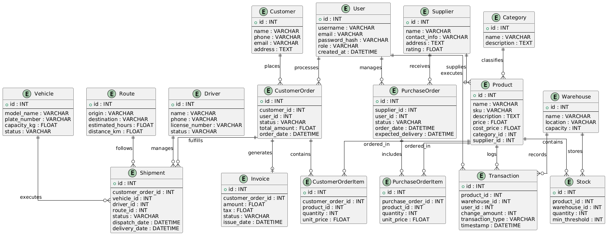
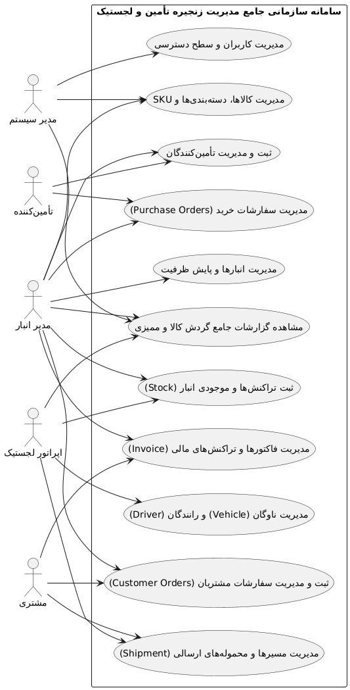

# Enterprise Supply Chain and Warehouse Management System

An advanced, enterprise-grade web application built with Python (Flask) and SQLAlchemy for real-time inventory tracking, multi-warehouse operations management, and secure role-based access control.

---

## Features and Modules
- **Role-Based Access Control (RBAC):** Secure management for Administrators, Warehouse Managers, Logistics Operators, and Suppliers.
- **Real-Time Inventory Tracking:** Automated stock adjustments coupled with immutable transaction auditing logs.
- **Multi-Warehouse Management:** Spatial capacity monitoring, threshold warnings, and location-based stock allocation.
- **Advanced Audit Trails:** Comprehensive database logging for every inbound and outbound supply chain movement.

---

## Tech Stack
- **Backend:** Python, Flask, Flask-SQLAlchemy
- **Database:** SQLite (Relational Enterprise Schema)
- **Documentation:** PlantUML (Architecture and Use Case Modeling)

---

## System Architecture and Diagrams

### 1. Entity-Relationship Diagram (ERD)
The database schema handles relational integrity across Users, Suppliers, Warehouses, Products, Stocks, and Transactions:



### 2. Use Case Diagram
System interaction mapping across different administrative and operational actors:


---

# سند تحلیل و مهندسی نیازمندی‌ها (SRS)
## سامانه مدیریت انبار و زنجیره تأمین (Supply Chain Management System)

---

## ۱. مقدمه و معرفی پروژه
### ۱-۱. هدف پروژه
هدف از این پروژه، طراحی و پیاده‌سازی یک سامانه یکپارچه‌ تحت وب برای مدیریت بهینه جریان مواد، کنترل موجودی انبارها، ثبت سفارش‌های خرید و فروش، مدیریت ارتباط با تأمین‌کنندگان و مشتریان، و ردیابی فرآیندهای لجستیکی است. این سیستم به سازمان‌ها کمک می‌کند تا هزینه‌های انبارداری را کاهش داده و دقت و سرعت زنجیره تأمین را به حداکثر برسانند.

### ۱-۲. دامنه کاربرد
سامانه شامل ماژول‌های مدیریت کاربران، مدیریت کالاها و دسته‌بندی‌ها، انبارها و موجودی، مدیریت تأمین‌کنندگان، سفارش‌های خرید و فروش، لجستیک و حمل‌ونقل، صورت‌حساب‌های مالی و گزارش‌گیری پیشرفته خواهد بود.

---

## ۲. ذی‌نفعان و بازیگران سیستم (Actors)
1. **مدیر سیستم (Admin):** مسئول مدیریت دسترسی‌ها، کاربران، تنظیمات کلی سیستم و بررسی لاگ‌های امنیتی.
2. **مدیر انبار (Warehouse Manager):** نظارت بر موجودی انبارها، ثبت تراکنش‌های ورود و خروج، انجام انبارگردانی و مدیریت نقاط سفارش (Thresholds).
3. **مسئول خرید / تأمین (Procurement Officer):** ثبت و پیگیری سفارش‌های خرید از تأمین‌کنندگان و ارزیابی عملکرد آن‌ها.
4. **تامین‌کننده (Supplier):** مشاهده سفارش‌های خرید ارسالی و تایید یا رد اقلام.
5. **مشتری (Customer):** ثبت سفارش‌های فروش و پیگیری وضعیت ارسال مرسولات.
6. **اپراتور لجستیک (Logistics Operator):** مدیریت رانندگان، وسایل نقلیه، مسیرها و صدور بارنامه‌ها و شیپمنت‌ها.

---

## ۳. نیازمندی‌های کارکردی (Functional Requirements)
در جدول زیر، قابلیت‌ها و رفتارهای اصلی سیستم آورده شده است:

| شناسه | شرح نیازمندی کارکردی | اولویت | معیار پذیرش (قابل آزمون) |
| :--- | :--- | :--- | :--- |
| **FR-1** | سیستم باید امکان ثبت‌نام، ورود و مدیریت کاربران با نقش‌های مختلف (مدیر، انباردار، اپراتور) را فراهم کند. | بالا | کاربران تنها به بخش‌های مجاز بر اساس نقش خود دسترسی داشته باشند. |
| **FR-2** | مدیر انبار باید بتواند کالاهای جدید را با مشخصات کامل (نام، کد SKU، قیمت خرید و فروش، واحد اندازه‌گیری) ثبت کند. | بالا | پس از ثبت، کالا بلافاصله در فهرست پایگاه داده و لیست محصولات قابل مشاهده باشد. |
| **FR-3** | سیستم باید دسته‌بندی محصولات را به صورت درختی و چندسطحی پشتیبانی کند. | متوسط | امکان تعیین دسته‌بندی والد و فرزند برای کالاها وجود داشته باشد. |
| **FR-4** | سیستم باید به محض کاهش موجودی کالا کمتر از نقطه سفارش (Reorder Point)، هشدارهای لازم را به مدیر خرید نمایش دهد. | بالا | با رسیدن موجودی به آستانه تعیین‌شده، اعلان هشدار در داشبورد ثبت شود. |
| **FR-5** | مدیر انبار باید بتواند انبارهای متعدد را تعریف کرده و موجودی کالاها را به تفکیک هر انبار مدیریت کند. | بالا | موجودی هر کالا در هر انبار به صورت مستقل ثبت و به‌روزرسانی شود. |
| **FR-6** | مسئول خرید باید بتواند سفارش خرید (Purchase Order) جدید برای تأمین‌کنندگان ثبت کند. | بالا | سند سفارش با شماره پیگیری یکتا صادر و ذخیره شود. |
| **FR-7** | تأمین‌کننده باید بتواند به پنل خود وارد شده و وضعیت سفارش‌های خرید ارسالی را تایید یا رد کند. | متوسط | تغییر وضعیت سفارش بلافاصله در سیستم مرکزی ثبت شود. |
| **FR-8** | سیستم باید قابلیت ثبت تراکنش‌های انبار شامل ورود کالا، خروج کالا، ضایعات و انتقال بین انبارها را داشته باشد. | بالا | با هر تراکنش، موجودی انبار مبدأ و مقصد به طور دقیق اصلاح شود. |
| **FR-9** | واحد فروش باید بتواند سفارش فروش (Sales Order) جدید برای مشتریان ثبت کند. | بالا | موجودی کالا پس از تایید سفارش فروش رزرو یا کسر گردد. |
| **FR-10**| اپراتور لجستیک باید بتواند اطلاعات رانندگان، خودروها و مسیرهای حمل‌ونقل را ثبت و مدیریت کند. | متوسط | امکان انتخاب خودرو و راننده آزاد برای ارسال بار فراهم باشد. |
| **FR-11**| سیستم باید برای سفارش‌های فروش تایید شده، بارنامه (Shipment) و اسناد لجستیکی صادر کند. | متوسط | شماره بارنامه و وضعیت ارسال قابل پیگیری باشد. |
| **FR-12**| سیستم باید قابلیت تولید خودکار فاکتورهای مالی بر اساس اقلام سفارش فروش را داشته باشد. | پایین | فاکتور با محاسبه مالیات و تخفیف به صورت خودکار ایجاد شود. |
| **FR-13**| مدیر سیستم باید بتواند از پایگاه داده نسخه پشتیبان (Backup) تهیه کرده یا آن را بازیابی کند. | بالا | فایل پشتیبان با موفقیت ذخیره و در صورت نیاز بازیابی شود. |
| **FR-14**| سیستم باید گزارش‌های جامع گردش کالا، موجودی انبار، میزان فروش و هزینه‌ها را ارائه دهد. | متوسط | گزارش‌ها قابلیت فیلتر بر اساس بازه زمانی را داشته باشند. |
| **FR-15**| سامانه باید سوابق فعالیت‌های حساس کاربران (Audit Log) را برای ممیزی ذخیره کند. | پایین | زمان، کاربر و نوع عملیات انجام‌شده در جدول لاگ ثبت شود. |

---

## ۴. نیازمندی‌های غیرکارکردی (Non-Functional Requirements)
ویژگی‌های کیفی و فنی سامانه به شرح زیر است:

| شناسه | شرح نیازمندی غیرکارکردی | معیار ارزیابی و تست |
| :--- | :--- | :--- |
| **NFR-1** | **کارایی و سرعت:** زمان پاسخ‌دهی سیستم به درخواست‌های جستجوی کالا و نمایش گزارش‌ها نباید از ۳ ثانیه بیشتر باشد. | تست بار (Load Testing) با ابزارهای استاندارد در شرایط ترافیک نرمال. |
| **NFR-2** | **امنیت داده‌ها:** رمز عبور تمام کاربران باید قبل از ذخیره در پایگاه داده با الگوریتم‌های استاندارد (مثل Bcrypt) هش شود. | بررسی مستقیم پایگاه داده برای اطمینان از عدم ذخیره متن ساده پسوردها. |
| **NFR-3** | **پایداری سیستم:** سامانه باید دست‌کم ۹۹.۹ درصد در طول ماه در دسترس کاربران (بدون قطعی برنامه‌ریزی‌نشده) باشد. | مانیتورینگ مداوم آپ‌تیم سرور و سرویس‌های میزبان. |
| **NFR-4** | **مقیاس‌پذیری:** معماری پایگاه داده و اپلیکیشن باید به گونه‌ای باشد که با افزایش تعداد کالاها و انبارها افت عملکرد شدید پیدا نکند. | طراحی اصولی روابط در ERD و ایندکس‌گذاری روی فیلدهای پرکاربرد. |
| **NFR-5** | **امنیت ارتباطات:** تمامی ارتباطات بین مرورگر کاربر و سرور باید از طریق پروتکل امن HTTPS و رمزنگاری SSL انجام شود. | بررسی گواهی‌های امنیتی سرور. |
| **NFR-6** | **قابلیت استفاده (Usability):** رابط کاربری باید واکنش‌گرا (Responsive) بوده و در ابعاد مختلف صفحه نمایش به خوبی کار کند. | تست نمایش در اندازه‌های مختلف مانیتور و تبلت. |
| **NFR-7** | **کنترل دسترسی (Authorization):** سیستم باید از دسترسی‌های غیرمجاز به اطلاعات مالی و انبارداری جلوگیری کند. | تست تست‌پذیری نقش‌ها (Role-Based Access Control). |
| **NFR-8** | **نگهداری‌پذیری:** کدهای برنامه باید مستندسازی شده و ساختار ماژولار داشته باشند تا توسعه و رفع باگ در آینده تسهیل شود. | بررسی تمیزی کد (Clean Code) و رعایت استانداردهای معماری لایه‌ای. |

---

## Installation and Setup

**1. Clone the repository:**
   ```bash
   git clone [https://github.com/soroshTypeG/supply-chain-management-system.git](https://github.com/soroshTypeG/supply-chain-management-system.git)
   cd supply-chain-management-system
```

**Install dependencies:**

```bash
pip install -r requirements.txt
```

**Run the application:**

Before running the app.py first you got to run the seed.py script:
```bash
python seed.py
```

Then:
```bash
python app.py
```

## Testing

The project includes an automated test suite using Python's built-in `unittest` framework to verify database integrity, model relationships, and HTTP route responses.

To run the test suite, execute:
```bash
python test_app.py
```


---

## راهنمای فارسی (Persian Overview)

سامانه سازمانی مدیریت انبار و زنجیره تأمین یک برنامه تحت وب پیشرفته است که با پایتون (Flask) و SQLAlcسامانه سازمانی مدیریت انبار و زنجیره تأمین

یک برنامه وب پیشرفته و در سطح سازمانی که با پایتون (Flask) و SQLAlchemy برای ردیابی لحظه‌ای موجودی، مدیریت عملیات چندانبار و کنترل دسترسی امن نقش‌محور ساخته شده است.

**ویژگی ها و ماژول ها:**

کنترل دسترسی نقش‌محور (RBAC): مدیریت امن برای مدیران، مدیران انبار، اپراتورهای لجستیک و تأمین‌کنندگان.

ردیابی موجودی در زمان واقعی: تنظیمات خودکار موجودی همراه با لاگ‌های حسابرسی تراکنش تغییرناپذیر.

مدیریت چند انبار: پایش ظرفیت فضایی، هشدارهای آستانه و تخصیص موجودی مبتنی بر موقعیت مکانی.

مسیرهای حسابرسی پیشرفته: ثبت جامع پایگاه داده برای هرگونه جابجایی ورودی و خروجی در زنجیره تأمین.

**فناوری های استفاده شده:**

بخش پشتی (Backend): پایتون، Flask، Flask-SQLAlchemy

پایگاه داده: SQLite (طرحواره رابطه‌ای سازمانی)

مستندات: PlantUML (مدل‌سازی معماری و موارد استفاده).

### نصب و راه‌اندازی سریع
۱. کلون کردن مخزن:
   ```bash
   git clone [https://github.com/soroshTypeG/supply-chain-management-system.git](https://github.com/soroshTypeG/supply-chain-management-system.git)
   cd supply-chain-management-system
```

**۲. نصب پکیج‌های مورد نیاز:**
```bash
pip install -r requirements.txt
```
**۳. اجرای برنامه:**

قبل از اجرای برنامه باید اول اسکریپت seed.py را اجرا کنید:
```bash
python seed.py
```

بعد:
```bash
python app.py
```

پروژه شامل یک مجموعه تست خودکار با استفاده از فریم‌ورک داخلی unittest در پایتون است تا یکپارچگی پایگاه داده، روابط مدل‌ها و پاسخ‌های مسیرهای HTTP را بررسی کند.
برای اجرای مجموعه تست، این دستور را اجرا کنید:
```bash
python test_app.py
```
